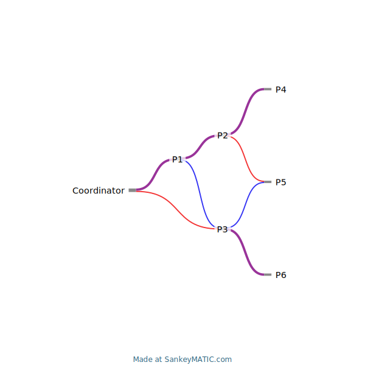

# shardstream

## Introduction

The shardstream protocol is Bittorrent for livestreams. It defines a general purpose framework for streaming data through a tree shaped network built of one Coordinator node and many Peer nodes.

The protocol includes a discovery handshake wherin the coordinator redirects new Peers down the tree to a leaf with minimal connected children. This distributes the flow of data evenly across the
network. The max required upload bandwith for any particular node is equal to twice that of the incoming data bandwidth.

## shardstreamTerminal

To use the terminal based example, start two processes using the following steps:

```
go run examples/shardstreamTerminal coordinator -l localhost:1234
```

```
go run examples/shardstreamTerminal peer -c localhost:1234 -l localhost:1235
```

## VLC Livestreaming

The following steps build a simple example of livestreaming an MP4 file over shardstream, piping the output into a VLC instance started from within WSL.

Make an alias to your local VLC installation:
```
alias vlcexe='/c/Program\ Files/VideoLAN/VLC/vlc.exe'
```

Start the video stream:
```
vlcexe -q --loop /path/to/video.mp4 --sout='#duplicate{dst=file{mux=ts,dst='-'}}' | go run examples/shardstreamTerminal/ coordinator -l localhost:1234
```

Connect a peer node to view the video:
```
go run examples/shardstreamTerminal/ peer -c localhost:1234 -l localhost:1235 | vlcexe -q -
```

Optional - Transcode the video to h264 to better support stream interruptions:
```
--sout='#transcode{venc=x264{keyint=60,idrint=2},vcodec=h264,samplerate=22050}:duplicate{dst=file{mux=ts,dst='-'},dst=display}'
```

## A 1.5 Branching Factor

With a shard-count of 2, each node serves up 3 shards, or 1.5 of the incoming bandwidth. To accomplish this effectively the network distribution tree assumes a tessellation of the following shape:



In this diagram nodes P1, P2, P4, and P6 all consume a single connection transmitting a data stream of both shards.

However, nodes P3 and P5 both take on 2 parents, each of which serve a separate half of the data stream.

This tree structure triples the number of nodes at each layer every three layers deep you transmit.
That is to say it DOES grow exponentially as layers are added.
In fact if you model the number of layers required to distribute a stream across 1 million nodes this 1.5 branching factor tree is less than twice as tall as a binary tree of 1 million nodes would be.

## TODO

1. Shard data streams across nodes without creating cycles. As a peer I would like to consume all shards of the data stream while serving only one slice of the stream to downstream peers.
2. "loss resistance": As a peer if my upstream node disconnects I would like to be able to reconnect to the network seamlessly without losing data.
3. RTMP livestreaming module
4. Ping-based tree construction. As a coordinator I would like the edges of my network to be as short as possible.
5. "auto-rebalancing": When a large branch of the network fails, the protocol should rebuild the network with knowledge of the depth of the resulting orphaned networks, maintaining minimal network
   depth.
